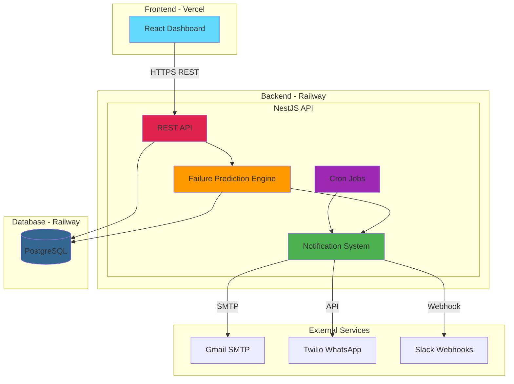
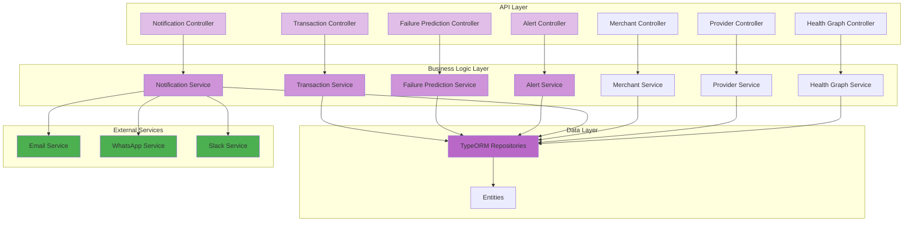
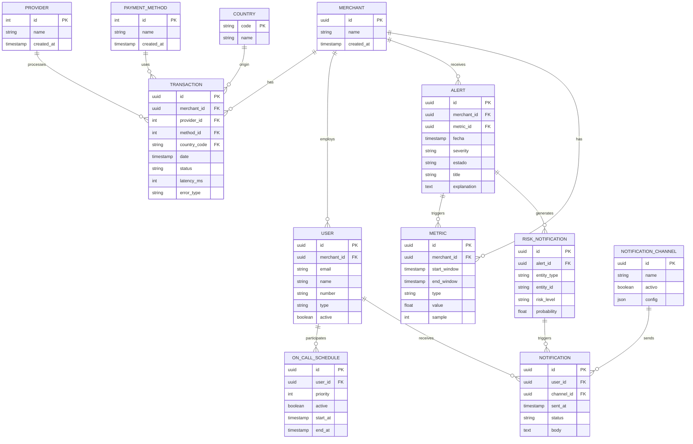
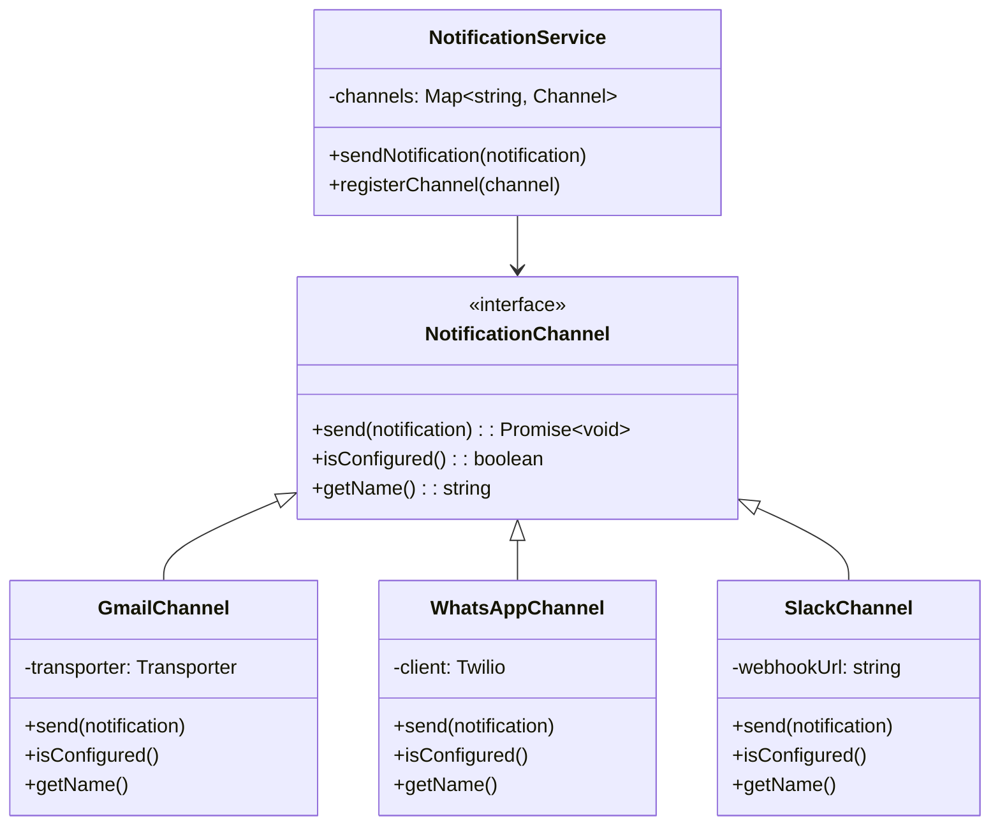
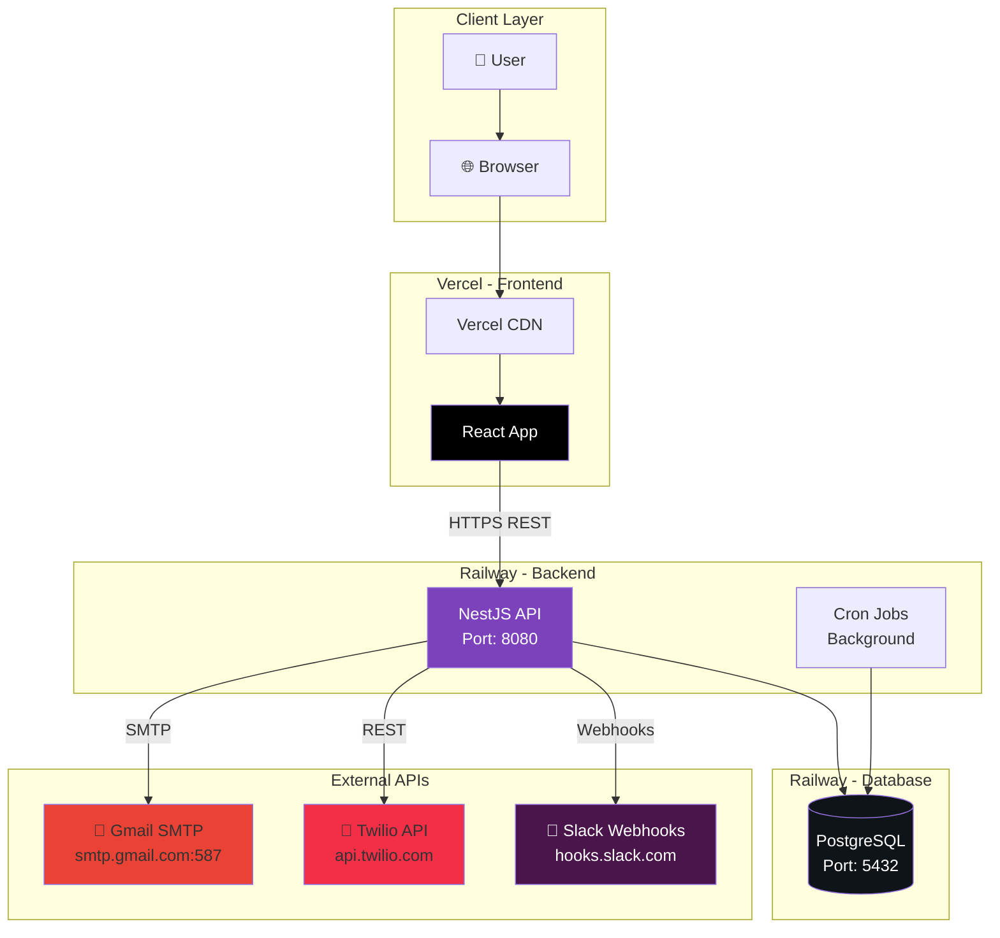

# 🚀 Yuno Payment Intelligence Platform - Backend

Intelligent payment failure detection and prediction system, designed to automatically identify anomalies and correlate issues across merchants, providers, payment methods, and countries.

[](https://nestjs.com/)
[](https://www.typescriptlang.org/)
[](https://www.postgresql.org/)
[](https://typeorm.io/)
[](https://railway.app/)

---

## 📋 Table of Contents

- [Overview](#-overview)
- [Problem Statement](#-problem-statement)
- [Architecture](#-architecture)
- [Project Structure](#-project-structure)
- [Data Model](#-data-model)
- [API Endpoints](#-api-endpoints)
- [Installation & Setup](#-installation--setup)
- [Notification Channels](#-notification-channels)
- [Deployment](#-deployment)
- [Technologies Used](#-technologies-used)

---

## 🎯 Overview

The **Yuno Payment Intelligence Platform** is a backend solution developed for the Yuno Hackathon (Challenge 2), implementing a **granular and intelligent alert system** for automatic payment failure detection.

### Main Features

✅ **Automatic Anomaly Detection**
- Real-time transaction analysis
- Failure pattern identification
- Multi-dimensional correlation (merchant-provider-method-country)

✅ **AI-Powered Failure Prediction**
- Multi-signal prediction algorithm
- Failure probability calculation
- Risk levels: CRITICAL, HIGH, MEDIUM, LOW

✅ **Multi-Channel Alert System**
- Email notifications (Gmail/SMTP)
- WhatsApp notifications (Twilio)
- Slack notifications (Webhooks)
- On-call rotation system

✅ **Route Health Analysis**
- Payment route health graph
- Performance metrics (approval rate, error rate, latency)
- Historical baseline comparison

✅ **Transaction Forecasting**
- Transaction volume prediction
- Expected vs Actual comparison
- Holt-Winters algorithm for time series

---

## 🔍 Problem Statement

### 2.1 Problem Description

Currently, there is no **granular, intelligent, and automatic** way to detect payment failures.

When a failure occurs, we cannot answer quickly:
- ❓ Is it a merchant problem?
- ❓ Is it a provider problem?
- ❓ Does it affect a specific method?
- ❓ Is it a complete country or something isolated?

The problem worsens because:
- ⚠️ Alerts are generic
- ⚠️ There's no correlation between entities
- ⚠️ We don't distinguish global vs local problems

### 2.2 Challenge Objective

Design a solution that:
1. **Automatically detects anomalies**
2. **Correlates** merchant, provider, method, and country
3. **Identifies the real origin of the problem**
4. **Clearly explains** what happened and why

It should help answer questions like:
- 🔎 Did a specific merchant have a failure?
- 🔎 Did a provider fail globally or only in one method?
- 🔎 Is the problem the configuration or the provider?

### 2.3 Our Solution

We implemented a system that:

✅ **Clear entity visualization**
- Dashboard with metrics by merchant, provider, method, country

✅ **Intelligent failure correlation**
- Algorithm that identifies common patterns
- Multi-dimensional error analysis

✅ **Automatic alerts**
- Proactive detection system
- Multi-channel notifications (Email, WhatsApp, Slack)

✅ **Problem explanation**
- Detailed context for each alert
- Action suggestions

✅ **Failure prediction**
- AI that predicts failure probability
- Top 3 at-risk entities

---

## 🏗️ Architecture

### General Architecture Diagram



### Component Diagram




---

## 📁 Project Structure

```
Yuno-Back-Reto2/
├── src/
│   ├── alert/                      # 🚨 Alert system
│   │   ├── entities/
│   │   │   └── alert.entity.ts     # Alert entity
│   │   ├── dto/
│   │   │   └── create-alert.dto.ts
│   │   ├── alert.controller.ts
│   │   ├── alert.service.ts
│   │   └── alert.module.ts
│   │
│   ├── failure-prediction/         # 🔮 Failure prediction engine
│   │   ├── dto/
│   │   │   └── failure-prediction.dto.ts
│   │   ├── failure-prediction.controller.ts
│   │   ├── failure-prediction.service.ts
│   │   └── failure-prediction.module.ts
│   │
│   ├── health-graph/               # 📊 Route health analysis
│   │   ├── dto/
│   │   ├── health-graph.controller.ts
│   │   ├── health-graph.service.ts
│   │   └── health-graph.module.ts
│   │
│   ├── notification/               # 📧 Notification system
│   │   ├── entities/
│   │   │   └── notification.entity.ts
│   │   ├── notification.controller.ts
│   │   ├── notification.service.ts
│   │   └── notification.module.ts
│   │
│   ├── notification-channel/       # 📱 Notification channels
│   │   ├── entities/
│   │   │   └── notification-channel.entity.ts
│   │   ├── channels/
│   │   │   ├── gmail.channel.ts     # Gmail/SMTP
│   │   │   ├── whatsapp.channel.ts  # Twilio WhatsApp
│   │   │   └── slack.channel.ts     # Slack Webhooks
│   │   ├── notification-channel.controller.ts
│   │   ├── notification-channel.service.ts
│   │   └── notification-channel.module.ts
│   │
│   ├── risk-notification/          # ⚡ Risk notifications
│   │   ├── entities/
│   │   ├── risk-notification.controller.ts
│   │   ├── risk-notification.service.ts
│   │   └── risk-notification.module.ts
│   │
│   ├── transaction/                # 💳 Transaction management
│   │   ├── entities/
│   │   │   └── transaction.entity.ts
│   │   ├── transaction.controller.ts
│   │   ├── transaction.service.ts
│   │   └── transaction.module.ts
│   │
│   ├── merchant/                   # 🏪 Merchant management
│   │   ├── entities/
│   │   │   └── merchant.entity.ts
│   │   ├── merchant.controller.ts
│   │   ├── merchant.service.ts
│   │   └── merchant.module.ts
│   │
│   ├── provider/                   # 💳 Provider management
│   │   ├── entities/
│   │   │   └── provider.entity.ts
│   │   ├── provider.controller.ts
│   │   ├── provider.service.ts
│   │   └── provider.module.ts
│   │
│   ├── payment-method/             # 💰 Payment methods
│   │   ├── entities/
│   │   ├── payment-method.controller.ts
│   │   └── payment-method.module.ts
│   │
│   ├── country/                    # 🌍 Country management
│   │   ├── entities/
│   │   ├── country.controller.ts
│   │   └── country.module.ts
│   │
│   ├── metric/                     # 📈 Aggregated metrics
│   │   ├── entities/
│   │   │   └── metric.entity.ts
│   │   ├── metric.controller.ts
│   │   ├── metric.service.ts
│   │   └── metric.module.ts
│   │
│   ├── on-call/                    # 👨‍💼 On-call system
│   │   ├── entities/
│   │   │   └── on-call-schedule.entity.ts
│   │   ├── on-call.controller.ts
│   │   ├── on-call.service.ts
│   │   └── on-call.module.ts
│   │
│   ├── user/                       # 👤 User management
│   │   ├── entities/
│   │   │   └── user.entity.ts
│   │   ├── user.controller.ts
│   │   ├── user.service.ts
│   │   └── user.module.ts
│   │
│   ├── seed/                       # 🌱 Test data
│   │   ├── seed.controller.ts
│   │   ├── seed.service.ts
│   │   ├── simple-seed.service.ts  # Simplified seed
│   │   └── seed.module.ts
│   │
│   ├── database/                   # 🗄️ Database config
│   │   └── database.module.ts
│   │
│   ├── common/                     # 🔧 Common utilities
│   │   └── enums.ts
│   │
│   ├── app.module.ts               # 📦 Main module
│   └── main.ts                     # 🚀 Entry point
│
├── test/                           # 🧪 Tests
├── docker-compose.yaml             # 🐳 Docker setup
├── package.json                    # 📦 Dependencies
├── tsconfig.json                   # ⚙️ TypeScript config
└── README.md                       # 📖 This file
```

---

## 🗄️ Data Model

### Entity-Relationship (ER) Diagram



### Main Entity Descriptions

#### 🏪 **Merchant**
Represents businesses that process payments.
- `id`: Unique identifier (UUID)
- `name`: Merchant name
- `created_at`: Creation date

#### 💳 **Provider**
Payment processors (Stripe, Adyen, DLocal, etc.)
- `id`: Unique identifier
- `name`: Provider name

#### 💰 **Payment Method**
Available payment methods.
- `id`: Unique identifier
- `name`: Card, PSE, Wallet, etc.

#### 🌍 **Country**
Countries where transactions are processed.
- `code`: ISO code (CO, MX, BR, etc.)
- `name`: Country name

#### 💵 **Transaction**
Processed payment transaction.
- `merchant_id`, `provider_id`, `method_id`, `country_code`: FK to other entities
- `status`: approved, declined, error, timeout
- `latency_ms`: Processing latency
- `error_type`: Error type if applicable

#### 🚨 **Alert**
System-generated alert.
- `severity`: critical, warning, info
- `estado`: open, acknowledged, resolved
- `title`: Alert title
- `explanation`: Detailed explanation

#### 📈 **Metric**
Aggregated metric by time window.
- `type`: approval_rate, error_rate, p95_latency
- `value`: Metric value
- `sample`: Sample size

#### 📧 **Notification**
Notification sent to a user.
- `user_id`: Recipient user
- `channel_id`: Channel used
- `status`: sent, failed, pending
- `body`: Message content

---

## 🔌 API Endpoints

### Base URL
```
Production: https://nestjs-starter-typeorm-production-131b.up.railway.app/api/v1
Local: http://localhost:8080/api/v1
```

### 📊 Transactions

#### `GET /transactions/approved-forecast`
Gets approved transaction forecast.

**Query Parameters:**
- `merchant_id` (UUID): Merchant ID
- `provider_id` (number): Provider ID
- `method_id` (number): Method ID
- `country_code` (string): Country code

**Response:**
```json
{
  "expected": [60, 75, 80, 70, 90, 65, 55],
  "actual": [50, 70, 95, 60, 85, 80, 45],
  "dates": ["2025-12-08", "2025-12-09", ...]
}
```

#### `GET /transactions/options-tree`
Gets options tree for filters.

**Response:**
```json
{
  "merchants": [
    {
      "id": "uuid",
      "name": "Shopito",
      "providers": [...],
      "methods": [...],
      "countries": [...]
    }
  ]
}
```

### 🔮 Failure Prediction

#### `GET /failure-prediction`
Gets failure predictions.

**Query Parameters:**
- `entity_type`: merchant | provider | method | country | route
- `merchant_id` (optional)
- `provider_id` (optional)
- `method_id` (optional)
- `country_code` (optional)
- `time_window_minutes` (default: 60)
- `baseline_window_hours` (default: 168)
- `min_sample_size` (default: 1)
- `include_low_risk` (default: false)

**Response:**
```json
{
  "total_entities_analyzed": 4,
  "high_risk_count": 1,
  "medium_risk_count": 1,
  "low_risk_count": 2,
  "global_health_score": 75,
  "predictions": [
    {
      "entity_type": "provider",
      "entity_id": "3",
      "entity_name": "DLocal",
      "probability": 0.756,
      "risk_level": "CRITICAL",
      "confidence": 0.98,
      "sample_size": 180,
      "signals": [...],
      "baseline_comparison": {...},
      "trend": {
        "direction": "degrading",
        "rate_of_change": 0.12
      },
      "recommended_actions": [
        "🚨 IMMEDIATE ACTION REQUIRED",
        "Review error logs to identify failure pattern",
        "Consider automatic failover"
      ],
      "timestamp": "2025-12-14T18:00:00Z"
    }
  ]
}
```

#### `GET /failure-prediction/top3`
Gets Top 3 highest-risk entities.

**Response:**
```json
{
  "top_merchants": [...],
  "top_providers": [...],
  "top_methods": [...],
  "overall_top_3": [
    {
      "rank": 1,
      "entity_type": "provider",
      "entity_id": "3",
      "entity_name": "DLocal",
      "probability": 0.756,
      "risk_level": "CRITICAL",
      "error_rate": 0.38,
      "approval_rate": 0.40,
      "latency": 6500,
      "trend": "degrading",
      "sample_size": 180
    }
  ],
  "timestamp": "2025-12-14T18:00:00Z"
}
```

### 📊 Health Graph

#### `GET /health-graph`
Gets route health analysis.

**Query Parameters:**
- `merchant_id`
- `provider_id`
- `method_id`
- `country_code`
- `time_window_hours` (default: 24)

**Response:**
```json
{
  "routes": [
    {
      "merchant_name": "Shopito",
      "provider_name": "Stripe",
      "method_name": "Card",
      "country_code": "CO",
      "health_score": 95,
      "status": "healthy",
      "metrics": {
        "approval_rate": 0.95,
        "error_rate": 0.02,
        "p95_latency": 450,
        "total_transactions": 150
      }
    }
  ]
}
```

### 🚨 Alerts

#### `GET /alerts`
Lists all alerts.

#### `POST /alerts`
Creates a new alert.

**Body:**
```json
{
  "severity": "critical",
  "title": "High error rate detected",
  "explanation": "Error rate exceeded 15%",
  "merchant_id": "uuid"
}
```

#### `PATCH /alerts/:id/acknowledge`
Marks alert as acknowledged.

#### `PATCH /alerts/:id/resolve`
Marks alert as resolved.

### 📧 Notifications

#### `GET /notifications`
Lists notifications.

#### `POST /notifications/send`
Sends manual notification.

### 🌱 Seed

#### `POST /seed?reset=true`
Loads complete seed with test data (~3000 transactions).

#### `POST /seed-simple?reset=true`
Loads simplified seed for demos (~500 transactions).

---

## 🚀 Installation & Setup

### Prerequisites

- Node.js >= 18.x
- PostgreSQL >= 14.x
- npm or yarn

### 1. Clone the repository

```bash
git clone https://github.com/your-username/Yuno-Back-Reto2.git
cd Yuno-Back-Reto2
```

### 2. Install dependencies

```bash
npm install
```

### 3. Configure environment variables

Create `.env` file in root:

```env
# Database
DATABASE_HOST=localhost
DATABASE_PORT=5432
DATABASE_USER=postgres
DATABASE_PASSWORD=your_password
DATABASE_NAME=yuno_db

# Server
PORT=8080
NODE_ENV=development

# Email (Gmail)
GMAIL_USER=your-email@gmail.com
GMAIL_APP_PASSWORD=your-app-password

# WhatsApp (Twilio)
TWILIO_ACCOUNT_SID=your_account_sid
TWILIO_AUTH_TOKEN=your_auth_token
TWILIO_WHATSAPP_FROM=whatsapp:+14155238886

# Slack
SLACK_WEBHOOK_URL=https://hooks.slack.com/services/YOUR/WEBHOOK/URL
```

### 4. Run migrations (TypeORM syncs automatically)

```bash
npm run start:dev
```

### 5. Load test data

```bash
# Complete seed
curl -X POST http://localhost:8080/api/v1/seed?reset=true

# Or simplified seed for demos
curl -X POST http://localhost:8080/api/v1/seed-simple?reset=true
```

### 6. Access the API

```
http://localhost:8080/api/v1
```

### Available Scripts

```bash
# Development
npm run start:dev          # Development mode with hot-reload

# Production
npm run build              # Compile TypeScript
npm run start:prod         # Run in production

# Testing
npm run test               # Unit tests
npm run test:e2e           # E2E tests
npm run test:cov           # Coverage

# Linting
npm run lint               # ESLint
npm run format             # Prettier
```

---

## 📱 Notification Channels

The system implements a **Strategy pattern** for notification channels, allowing easy addition of new channels.

### Channel Architecture



### 1. 📧 Gmail Channel (SMTP)

**Implementation:** `src/notification-channel/channels/gmail.channel.ts`

**Configuration:**
```typescript
{
  name: 'gmail',
  activo: true,
  config: {
    from: 'noreply@yuno.com',
    user: process.env.GMAIL_USER,
    password: process.env.GMAIL_APP_PASSWORD
  }
}
```

**Usage:**
- Critical alerts
- Daily reports
- Merchant notifications

**Library:** `nodemailer`

### 2. 📱 WhatsApp Channel (Twilio)

**Implementation:** `src/notification-channel/channels/whatsapp.channel.ts`

**Configuration:**
```typescript
{
  name: 'whatsapp',
  activo: true,
  config: {
    from: 'whatsapp:+14155238886',
    accountSid: process.env.TWILIO_ACCOUNT_SID,
    authToken: process.env.TWILIO_AUTH_TOKEN
  }
}
```

**Usage:**
- Urgent critical alerts
- On-call notifications
- Incident escalation

**Library:** `twilio`

### 3. 💬 Slack Channel (Webhooks)

**Implementation:** `src/notification-channel/channels/slack.channel.ts`

**Configuration:**
```typescript
{
  name: 'slack',
  activo: true,
  config: {
    webhookUrl: 'https://hooks.slack.com/services/...',
    channel: '#alerts'
  }
}
```

**Usage:**
- Technical team notifications
- Important event logs
- Real-time dashboards

**Message format:**
```json
{
  "text": "🚨 CRITICAL Alert",
  "blocks": [
    {
      "type": "section",
      "text": {
        "type": "mrkdwn",
        "text": "*Alert Details*\n..."
      }
    }
  ]
}
```

### Priority System

Notifications are sent based on severity:

| Severity | Channels |
|----------|----------|
| CRITICAL | WhatsApp + Email + Slack |
| WARNING | Email + Slack |
| INFO | Slack |

---

## 🚢 Deployment

### Deployment Diagram



### 🚂 Railway (Backend)

**Production URL:** `https://nestjs-starter-typeorm-production-131b.up.railway.app`

#### Configuration

1. **Environment variables:**
```env
DATABASE_URL=postgresql://...  # Provided by Railway
PORT=8080
NODE_ENV=production
GMAIL_USER=...
GMAIL_APP_PASSWORD=...
TWILIO_ACCOUNT_SID=...
TWILIO_AUTH_TOKEN=...
SLACK_WEBHOOK_URL=...
```

2. **Build Command:**
```bash
npm run build
```

3. **Start Command:**
```bash
npm run start:prod
```

### ▲ Vercel (Frontend)

**Frontend Repository:** `Yuno-Front-Reto2`

**Production URL:** `https://yuno-front-reto2.vercel.app`

#### Configuration

**Environment variables:**
```env
VITE_API_URL=https://nestjs-starter-typeorm-production-131b.up.railway.app/api/v1
```

### 🗄️ PostgreSQL (Database)

**Hosting:** Railway PostgreSQL Plugin

**Configuration:**
- Version: 16
- Connection: SSL enabled
- Auto-backup: Enabled

**Schema:** Auto-sync with TypeORM

---

## 🛠️ Technologies Used

### Backend Core

| Technology | Version | Usage |
|------------|---------|-------|
| **NestJS** | 11.0.1 | Main framework |
| **TypeScript** | 5.7.3 | Programming language |
| **TypeORM** | 0.3.28 | PostgreSQL ORM |
| **PostgreSQL** | 16 | Database |
| **class-validator** | 0.14.3 | DTO validation |
| **class-transformer** | 0.5.1 | Object transformation |

### Scheduling & Jobs

| Technology | Usage |
|------------|-------|
| **@nestjs/schedule** | Cron jobs for automatic alerts |
| **cron** | Scheduling expressions |

### Notifications

| Technology | Channel | Usage |
|------------|---------|-------|
| **nodemailer** | Email | Gmail/SMTP notifications |
| **twilio** | WhatsApp | Urgent WhatsApp alerts |
| **Slack Webhooks** | Slack | Team notifications |

### Development Tools

| Tool | Usage |
|------|-------|
| **ESLint** | Code linting |
| **Prettier** | Code formatting |
| **Jest** | Unit and e2e testing |
| **TypeScript ESLint** | TypeScript rules |

### Deployment

| Platform | Service |
|----------|---------|
| **Railway** | Backend API + Database |
| **Vercel** | React Frontend |

---

## 📊 Failure Prediction Algorithm

### Multi-Signal Model

The system uses an algorithm based on **4 signals** to predict failure probability:

#### 1. **Error Rate Signal** (Weight: 35%)
```
normalized_error_rate = min(error_rate / max_error_rate, 1)
contribution = normalized_error_rate * 0.35
```

#### 2. **Latency Signal** (Weight: 25%)
```
normalized_latency = min(p95_latency / max_latency, 1)
contribution = normalized_latency * 0.25
```

#### 3. **Approval Rate Signal** (Weight: 25%)
```
approval_gap = max(min_approval_rate - approval_rate, 0)
normalized = approval_gap / (1 - min_approval_rate)
contribution = normalized * 0.25
```

#### 4. **Trend Signal** (Weight: 15%)
```
trend = recent_error_rate - baseline_error_rate
normalized_trend = max(0, min(trend / max_error_rate, 1))
contribution = normalized_trend * 0.15
```

### Logistic Function

To smooth the final probability:

```
raw_score = Σ(contributions)
probability = 1 / (1 + e^(-10 * (raw_score - 0.5)))
```

### Risk Levels

| Probability | Risk Level |
|-------------|-----------|
| >= 0.75 | 🚨 CRITICAL |
| >= 0.50 | ⚠️ HIGH |
| >= 0.25 | 📊 MEDIUM |
| < 0.25 | ✅ LOW |

### Default Configuration

```typescript
{
  weights: {
    error_rate: 0.35,
    latency: 0.25,
    approval_rate: 0.25,
    trend: 0.15
  },
  thresholds: {
    critical: 0.75,
    high: 0.5,
    medium: 0.25
  },
  normalization: {
    max_error_rate: 0.5,
    max_latency: 10000,
    min_approval_rate: 0.3
  }
}
```

---

## 🎯 Use Cases

### 1. Provider Failure Detection

**Scenario:** DLocal experiences issues in Mexico

**Flow:**
1. System detects error_rate > 35% in DLocal
2. Correlates with multiple affected merchants
3. Identifies it's specific to Mexico
4. Generates CRITICAL alert
5. Sends notifications:
   - WhatsApp to on-call
   - Email to technical team
   - Message in Slack #alerts
6. Recommends:
   - Activate backup provider
   - Contact DLocal
   - Redirect traffic to PayU

### 2. Gradual Degradation

**Scenario:** Adyen shows latency degradation

**Flow:**
1. Trend signal detects gradual increase
2. p95_latency goes from 800ms to 2000ms
3. Approval rate drops from 90% to 75%
4. System predicts 55% probability (HIGH)
5. Generates WARNING alert
6. Sends notification via Email and Slack
7. Recommends:
   - Increase monitoring frequency
   - Review timeout configuration
   - Prepare contingency plan

### 3. Isolated Merchant Problem

**Scenario:** Shopito has failure only with PSE in Colombia

**Flow:**
1. System detects other merchants are OK
2. Same provider (Adyen) works fine with cards
3. Only affects PSE in Colombia
4. Identifies as configuration problem
5. Generates alert focused on Shopito
6. Recommends:
   - Review specific PSE configuration
   - Verify Adyen credentials
   - Test with test account

---

## 🔐 Security

### Environment Variables

❌ **NEVER** commit `.env` files to repository

✅ Use environment variables in Railway/Vercel

### Authentication

🚧 **TODO:** Implement JWT authentication in next version

### CORS

Configured to allow:
- `http://localhost:5173` (development)
- `https://yuno-front-reto2.vercel.app` (production)

---

## 🧪 Testing

### Unit Tests

```bash
npm run test
```

### E2E Tests

```bash
npm run test:e2e
```

### Coverage

```bash
npm run test:cov
```

---

## 📈 Metrics & Monitoring

### Health Endpoints

```bash
# Basic health check
GET /api/v1/health

# System statistics
GET /api/v1/metrics/stats
```

### Logs

Logs are automatically sent to Railway.

**Levels:**
- `error`: Critical errors
- `warn`: Warnings
- `log`: General info
- `debug`: Development

---

## 🤝 Contributing

### Workflow

1. Fork the repository
2. Create branch: `git checkout -b feature/new-feature`
3. Commit: `git commit -m 'Add new feature'`
4. Push: `git push origin feature/new-feature`
5. Create Pull Request

### Code Style

We follow style guides from:
- [NestJS Style Guide](https://docs.nestjs.com/fundamentals/coding-style)
- [TypeScript Best Practices](https://github.com/typescript-eslint/typescript-eslint)

---

## 📝 License

This project was developed for Yuno Hackathon - Challenge 2.

---

## 👥 Team

Developed with ❤️ for Yuno Hackathon

---

## 📞 Support

For questions or support:
- 📧 Email: j.manriquec@uniandes.edu.co
- 📧 Email: jd.riosn1@uniandes.edu.co
- 📧 Email: l.carretero@uniandes.edu.co
- 📧 Email: f.bogota@uniandes.edu.co
- Zero Gravity Team 

---

## 🚀 Roadmap

### Upcoming Features

- [ ] JWT Authentication
- [ ] Real-time metrics dashboard
- [ ] Integration with more providers (PayPal, MercadoPago)
- [ ] Machine Learning for more accurate predictions
- [ ] API rate limiting
- [ ] Swagger/OpenAPI documentation
- [ ] Event webhooks
- [ ] PDF/Excel report export

---

**Thank you for using Yuno Payment Intelligence Platform!** 🎉
